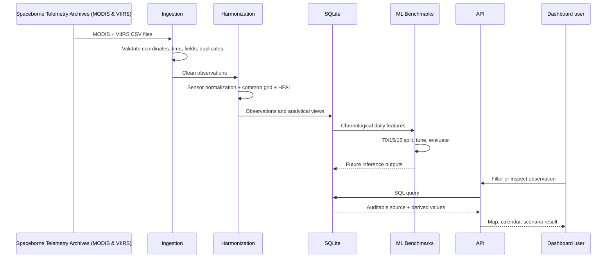
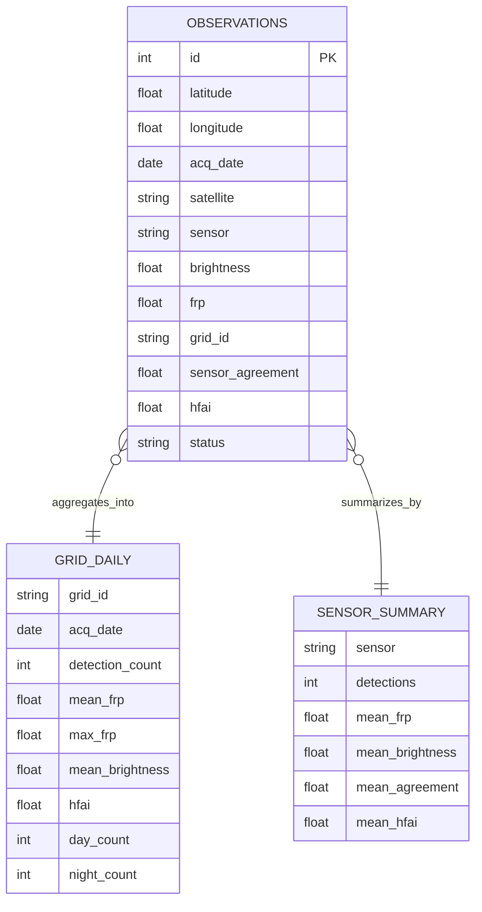
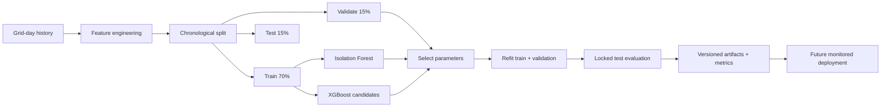

# Architecture and Experiment Protocol

## End-to-end research flow

## Data-layer design

## Model lifecycle

## Evaluation contract

- **Harmonization:** compare sensor correlation and distribution alignment before/after normalization.
- **Anomaly ranking:** validate top-ranked events against historical context; do not invent accuracy without labels.
- **Forecasting:** report MAE, RMSE, and R² on the untouched chronological test period against persistence and historical-mean baselines.
- **Explainability:** use importance and, at scale, SHAP values to explain forecast changes.
- **Safety:** communicate “satellite-detected activity,” never “confirmed wildfire,” without authoritative corroboration.

## Production extension

Replace the demonstration sample with multi-year grid-day tables, calculate paired sensor agreement, add weather and fuel-condition covariates, conduct event-based validation, register model/data versions, and monitor drift and missing-sensor coverage.
